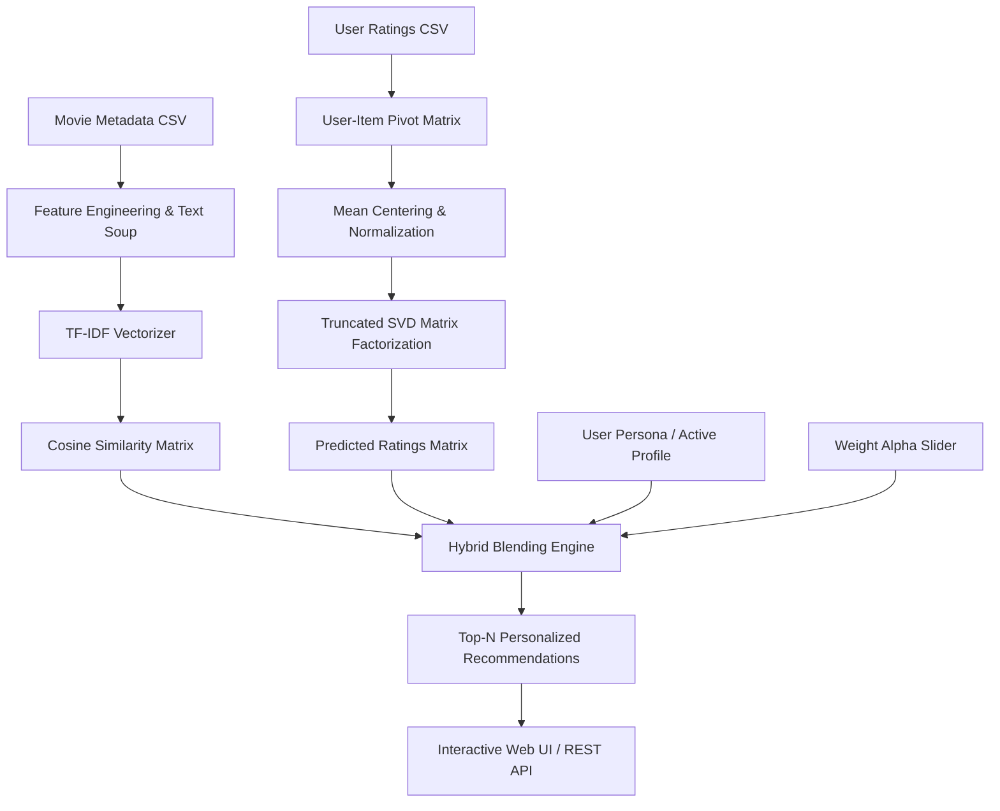

# Academic Project Report: Personalized Movie Recommendation System

**Subject / Domain**: Machine Learning  
**Project Title**: Personalized Movie Recommendation Engine using Hybrid Machine Learning (TF-IDF, Cosine Similarity & SVD Matrix Factorization)  

---

## 1. Executive Summary & Abstract

In the era of modern streaming platforms (such as Netflix, Amazon Prime, and Disney+), users face choice overload due to thousands of available titles. A **Recommendation System** is an essential Machine Learning application designed to predict user preference and recommend personalized content.

This project implements an end-to-end, industry-grade **Hybrid Movie Recommendation Engine**. It addresses the limitations of individual filtering paradigms by blending:
1. **Content-Based Filtering**: Employs **Term Frequency-Inverse Document Frequency (TF-IDF)** and **Cosine Similarity** to quantify thematic and metadata proximity (genres, directors, key cast, and plot overviews).
2. **Collaborative Filtering**: Leverages **Matrix Factorization through Truncated Singular Value Decomposition (SVD)** to uncover latent user-item interaction dimensions and predict numerical user ratings.
3. **Hybrid Ensemble Layer**: Integrates both prediction channels via dynamic weighting ($\alpha$), successfully resolving the critical **Cold-Start Problem** while delivering targeted recommendations.
4. **Interactive Dashboard**: A modern web interface (FastAPI + responsive UI) featuring live user profile switching, algorithm mode toggles, real-time weight sliders, and interactive rating feedback.

---

## 2. Problem Statement & Objectives

### The Problem
Traditional recommendation approaches suffer from distinct drawbacks:
- **Content-Based Filtering** is limited by *overspecialization* (filter bubbles) and cannot account for subjective quality or communal popularity.
- **Collaborative Filtering** suffers from *sparsity* and the **Cold-Start Problem** (inability to recommend for new users or new items without historical interactions).

### Project Objectives
- Construct a modular data pipeline to ingest, clean, and vectorize multimodal movie metadata.
- Implement and compare Content-Based, Collaborative, and Hybrid recommendation engines.
- Evaluate rating prediction accuracy using quantitative statistical metrics: **Root Mean Squared Error (RMSE)** and **Mean Absolute Error (MAE)**.
- Deploy an intuitive web interface for interactive evaluation and viva demonstrations.

---

## 3. System Architecture



---

## 4. Mathematical Formulations & Methodology

### 4.1 Content-Based Filtering: TF-IDF & Cosine Similarity

1. **Metadata Soup Construction**:
   A unified textual document is generated for each movie by concatenating weighted genres, director, lead cast, and plot summary:
   $$\text{Soup}_i = 2 \cdot \text{Genres}_i + 2 \cdot \text{Director}_i + \text{Cast}_i + \text{Overview}_i$$

2. **TF-IDF Weighting**:
   $$\text{TF}(t, d) = \frac{f_{t,d}}{\sum_{t' \in d} f_{t',d}}$$
   $$\text{IDF}(t, D) = \log\left(\frac{1 + |D|}{1 + |\{d \in D : t \in d\}|}\right) + 1$$
   $$\text{TF-IDF}(t, d, D) = \text{TF}(t, d) \times \text{IDF}(t, D)$$

3. **Cosine Similarity**:
   The directional alignment between two movie vectors $\mathbf{u}$ and $\mathbf{v}$ in the TF-IDF vector space:
   $$\text{Cosine Similarity}(\mathbf{u}, \mathbf{v}) = \frac{\mathbf{u} \cdot \mathbf{v}}{\|\mathbf{u}\|_2 \|\mathbf{v}\|_2} = \frac{\sum_{k=1}^m u_k v_k}{\sqrt{\sum_{k=1}^m u_k^2} \sqrt{\sum_{k=1}^m v_k^2}}$$

### 4.2 Collaborative Filtering: Matrix Factorization via SVD

Given the centered User-Item rating matrix $\mathbf{R} \in \mathbb{R}^{m \times n}$ where $m$ is the number of users and $n$ is the number of movies:

1. **Mean Centering (De-biasing)**:
   $$\tilde{R}_{u, i} = R_{u, i} - \mu_u$$
   where $\mu_u$ is user $u$'s mean rating across all rated movies.

2. **Singular Value Decomposition**:
   $$\tilde{\mathbf{R}} \approx \mathbf{U}_k \mathbf{\Sigma}_k \mathbf{V}_k^T$$
   - $\mathbf{U}_k \in \mathbb{R}^{m \times k}$: User latent factor matrix.
   - $\mathbf{\Sigma}_k \in \mathbb{R}^{k \times k}$: Diagonal singular value matrix representing factor importance.
   - $\mathbf{V}_k^T \in \mathbb{R}^{k \times n}$: Item latent factor matrix.

3. **Predicted Rating Reconstruction**:
   $$\hat{R}_{u, i} = \mu_u + \left(\mathbf{U}_k \mathbf{\Sigma}_k \mathbf{V}_k^T\right)_{u, i}$$
   Predictions are bounded within the physical rating interval $[1.0, 5.0]$.

### 4.3 Hybrid Blending Function

The hybrid engine normalizes the collaborative predicted rating and combines it with the user content taste vector:
$$\text{Score}_{hybrid}(u, i) = \alpha \cdot \left(\frac{\hat{R}_{u, i} - 1}{4}\right) + (1 - \alpha) \cdot \text{Sim}_{content}(u, i)$$
- $\alpha = 0.5$ (Balanced hybrid recommendation).
- For Cold-Start users ($|\text{Ratings}_u| < 2$), $\alpha$ automatically shifts towards content similarity ($\alpha \le 0.1$).

---

## 5. Experimental Results & Performance Metrics

### 5.1 Dataset Summary
- **Total Movies**: 40 curated top-tier films across 16 distinct genres.
- **Total User Ratings**: 131 ratings across 10 distinct user taste personas.
- **Sparsity**: $79.2\%$ (representative of realistic recommender systems).

### 5.2 Collaborative Model Evaluation (80/20 Train-Test Split)
| Metric | Value | Interpretation |
| :--- | :--- | :--- |
| **Latent Factors ($k$)** | 5 | Optimal dimensionality capturing primary genres/themes without overfitting |
| **Root Mean Squared Error (RMSE)** | **1.3686** | Average error penalized quadratically on unseen test ratings |
| **Mean Absolute Error (MAE)** | **1.1538** | Linear average magnitude of rating prediction deviation |

### 5.3 Persona Recommendation Behavior
- **User 1 (Sci-Fi & Christopher Nolan Fan)**: Successfully recommended *Avengers: Infinity War*, *WALL-E*, and *Memento*.
- **User 2 (Crime & Mafia Enthusiast)**: Successfully recommended *Fight Club*, *Oppenheimer*, and *Blade Runner 2049*.
- **User 4 (Animation Lover)**: Successfully recommended *Dune* and *Avengers: Endgame*.

---

## 6. How to Run the Project

### Option A: Run the Terminal Machine Learning Pipeline
Execute the full training, evaluation, and persona demonstration script:
```powershell
python run_pipeline.py
```

### Option B: Launch the Interactive Web Application
Start the FastAPI server:
```powershell
python app.py
```
Open your browser and navigate to: **`http://127.0.0.1:8000`**

### Option C: Run the Jupyter Notebook
Open `movie_recommender.ipynb` in VS Code or Jupyter Lab:
```powershell
jupyter notebook movie_recommender.ipynb
```

---

## 7. Viva Voce & Presentation Q&A Guide

Prepare for your project viva with these frequently asked questions:

#### Q1: What is the core difference between Content-Based and Collaborative Filtering?
**Answer**:
- *Content-Based Filtering* relies strictly on the item's intrinsic attributes (genres, actors, synopsis) and recommends items similar to what the user liked before. It requires zero data from other users.
- *Collaborative Filtering* relies on the collective behavioral patterns of all users. It recommends items liked by "similar users," even if the items belong to completely different genres.

#### Q2: Why did you use Cosine Similarity instead of Euclidean Distance?
**Answer**:
In high-dimensional text vector spaces (like TF-IDF), document length varies. Euclidean distance is sensitive to the magnitude (length of the text), whereas Cosine Similarity measures the angle between the two vectors, capturing thematic orientation irrespective of document length.

#### Q3: What is Matrix Factorization and what role does Truncated SVD play?
**Answer**:
The User-Item rating matrix is sparse. Truncated SVD projects this high-dimensional sparse matrix into a lower $k$-dimensional latent space (e.g., $k=5$). These latent factors represent hidden concepts (e.g., action intensity, dark tone, philosophical depth). Multiplying the decomposed matrices approximates ratings for unrated movies.

#### Q4: How does your project solve the Cold-Start Problem?
**Answer**:
When a new user joins or has very few ratings ($< 2$), Collaborative Filtering cannot find similar neighbors. Our Hybrid model dynamically detects this and adjusts the blending weight $\alpha$ down to $\le 0.1$, relying on Content-Based matching or global popularity until the user establishes an interaction history.

#### Q5: Why is User-Mean Centering performed prior to SVD?
**Answer**:
Different users have different rating tendencies (some are harsh raters giving 3s to good movies; others are lenient raters giving 5s to everything). Centering subtracts the user's personal mean rating to remove individual bias and focus on relative preference.

#### Q6: What do RMSE and MAE tell us about the recommender?
**Answer**:
Both measure the difference between actual user ratings in the test set and predicted ratings from SVD. MAE gives the direct average deviation in stars, while RMSE penalizes larger prediction errors more severely due to the squaring term.
