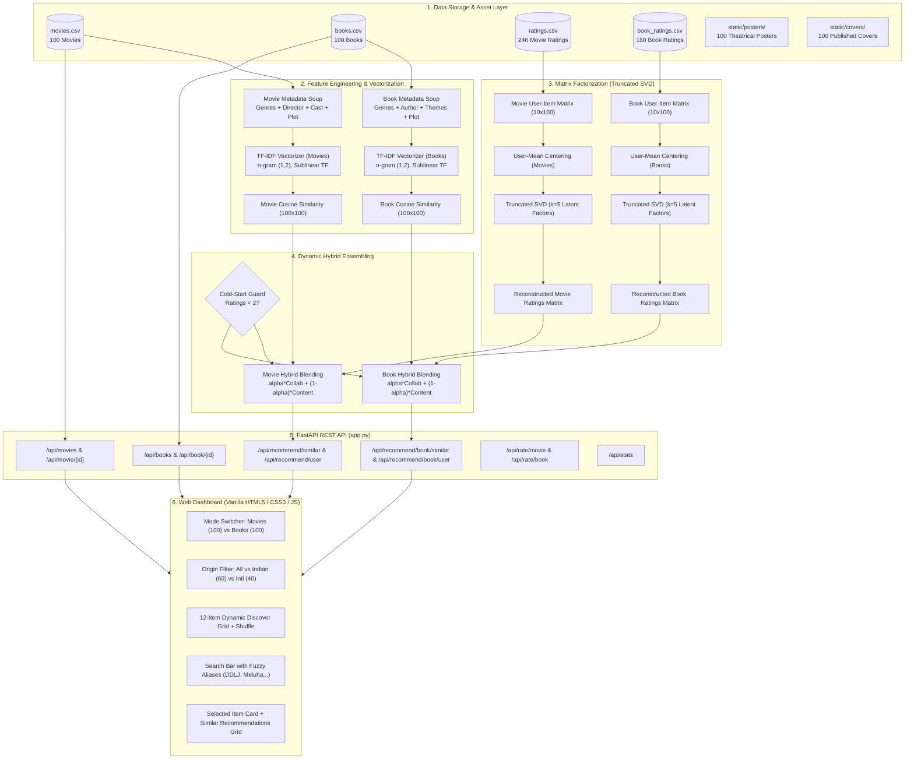

# 🎬📚 CineBook AI: Personalized Movie & Book Recommendation System

> **An end-to-end, dual-domain Machine Learning Recommendation Engine combining Content-Based Filtering (TF-IDF & Cosine Similarity) and Collaborative Filtering (Truncated SVD Matrix Factorization). It analyzes genres, directors, authors, themes, and user interactions to deliver personalized recommendations across 100 Films (40 Hollywood + 60 Bollywood) and 100 Books (60 Indian Writers + 40 International Writers) through a high-performance web dashboard.**

---

## 📑 Table of Contents
1. [Theoretical Background & Mathematical Foundation](#1-theoretical-background--mathematical-foundation)
   - [Recommendation Paradigms](#11-recommendation-paradigms)
   - [The Cold-Start & Sparsity Problems](#12-the-cold-start--sparsity-problems)
   - [Content-Based Filtering: TF-IDF & Cosine Similarity](#13-content-based-filtering-tf-idf--cosine-similarity)
   - [Collaborative Filtering: Truncated SVD Matrix Factorization](#14-collaborative-filtering-truncated-svd-matrix-factorization)
   - [Hybrid Blending Formulation](#15-hybrid-blending-formulation)
   - [Evaluation Metrics (RMSE & MAE)](#16-evaluation-metrics-rmse--mae)
2. [System Architecture](#2-system-architecture)
3. [Technical Workflow & Engine Explanation](#3-technical-workflow--engine-explanation)
   - [Phase 1: Data Ingestion & Metadata Soups](#phase-1-data-ingestion--metadata-soups)
   - [Phase 2: Content-Based Feature Pipeline](#phase-2-content-based-feature-pipeline)
   - [Phase 3: Collaborative Filtering Pipeline](#phase-3-collaborative-filtering-pipeline)
   - [Phase 4: Hybrid Recommender Execution](#phase-4-hybrid-recommender-execution)
   - [Phase 5: High-Performance REST API Layer](#phase-5-high-performance-rest-api-layer)
   - [Phase 6: Frontend Interaction & Cache-Busting](#phase-6-frontend-interaction--cache-busting)
4. [Dataset & Media Catalog Specifications](#4-dataset--media-catalog-specifications)
   - [100 Curated Movies](#100-curated-movies)
   - [100 Curated Books](#100-curated-books)
5. [Project Directory Structure](#5-project-directory-structure)
6. [REST API Documentation](#6-rest-api-documentation)
7. [How to Run This Application](#7-how-to-run-this-application)
   - [Prerequisites](#prerequisites)
   - [Installation & Execution](#installation--execution)
   - [Running Verification Tests](#running-verification-tests)

---

## 1. Theoretical Background & Mathematical Foundation

Recommendation systems assist users in discovering relevant items within vast catalog spaces. They are foundational to modern media platforms such as Netflix, Spotify, Amazon, and Goodreads.

### 1.1 Recommendation Paradigms

```
               ┌─────────────────────────────────────────────────────────┐
               │           Recommendation System Paradigms              │
               └────────────────────────────┬────────────────────────────┘
                                            │
            ┌───────────────────────────────┴───────────────────────────────┐
            ▼                                                               ▼
┌──────────────────────────────┐                              ┌──────────────────────────────┐
│    Content-Based Filtering   │                              │   Collaborative Filtering    │
├──────────────────────────────┤                              ├──────────────────────────────┤
│ • Analyzes item attributes   │                              │ • Analyzes user interactions │
│ • Metadata: Genres, authors, │                              │ • Rating patterns & matrices │
│   directors, themes, plots   │                              │ • User-to-user similarities  │
│ • No interaction data needed │                              │ • Serendipitous discoveries  │
│ • Vulnerable to filter bubble│                              │ • Cold-start vulnerability   │
└──────────────┬───────────────┘                              └──────────────┬───────────────┘
               │                                                             │
               └──────────────────────────────┬──────────────────────────────┘
                                              ▼
                             ┌──────────────────────────────────┐
                             │     Hybrid Recommender Engine    │
                             ├──────────────────────────────────┤
                             │ • Blends Content + Collaborative │
                             │ • Dynamic weighting (alpha)      │
                             │ • Overcomes Cold-Start & Bubbles │
                             └──────────────────────────────────┘
```

1. **Content-Based Filtering (CBF)**: Recommends items similar to those a user previously engaged with by comparing descriptive item attributes. While reliable for niche tastes and immune to user sparsity, it suffers from *overspecialization* (recommending only minor variations of familiar items).
2. **Collaborative Filtering (CF)**: Infers user tastes from the collective behavior of the community without requiring domain knowledge of item content. While capable of unexpected recommendations, it suffers from the *cold-start problem* when items or users have few or no ratings.
3. **Hybrid Filtering**: Combines the strengths of both paradigms. Collaborative predictions provide communal insight, while content-based similarity anchors recommendations when interaction data is sparse.

---

### 1.2 The Cold-Start & Sparsity Problems

- **User Cold-Start**: When a new user joins the platform, the collaborative interaction matrix has zero entries for them ($|\text{Ratings}_u| = 0$). SVD cannot generate personalized latent factor representations.
- **Item Cold-Start**: Newly added movies or books lack historical ratings, preventing collaborative engines from identifying similar items.
- **Data Sparsity**: In realistic rating matrices, over 95% of user-item pairs are unobserved.

**Our Mitigation Strategy**:
Our hybrid engine dynamically adjusts its reliance on collaborative signals based on the active user's rating history:
$$\alpha_{\text{effective}} = \begin{cases} 
\alpha, & \text{if } |\text{Ratings}_u| \ge 2 \\
0.05, & \text{if } |\text{Ratings}_u| < 2 \text{ (Cold-Start mode: 95\% Content-Based fallback)}
\end{cases}$$

---

### 1.3 Content-Based Filtering: TF-IDF & Cosine Similarity

#### Step 1: Metadata Soup Construction
For each item $i$, heterogeneous textual attributes are combined into an informative single document. Critical tokens (such as genres and creators) receive higher weights through token replication:

- **Movie Metadata Soup**:
  $$\text{Soup}_i = 2 \cdot \text{Genres}_i + 2 \cdot \text{Director}_i + \text{Cast}_i + \text{Overview}_i$$
- **Book Metadata Soup**:
  $$\text{Soup}_i = 2 \cdot \text{Genres}_i + 2 \cdot \text{Author}_i + 2 \cdot \text{Themes}_i + \text{Origin}_i + \text{Description}_i$$

#### Step 2: Term Frequency-Inverse Document Frequency (TF-IDF)
TF-IDF quantifies the importance of term $t$ in item document $d$ relative to the entire catalog corpus $D$:

1. **Term Frequency (TF)**:
   $$\text{TF}(t, d) = \frac{f_{t,d}}{\sum_{t' \in d} f_{t',d}}$$
   where $f_{t,d}$ is the raw frequency count of term $t$ in document $d$.

2. **Inverse Document Frequency (IDF)**:
   $$\text{IDF}(t, D) = \log\left(\frac{1 + |D|}{1 + |\{d \in D : t \in d\}|}\right) + 1$$
   This penalizes universally common words while emphasizing distinctive genre and thematic keywords.

3. **TF-IDF Weight**:
   $$\text{TF-IDF}(t, d, D) = \text{TF}(t, d) \times \text{IDF}(t, D)$$

#### Step 3: Cosine Similarity
Each item is represented as an $L_2$-normalized vector $\mathbf{v}_i \in \mathbb{R}^{V}$ in vocabulary space. The semantic proximity between two items $\mathbf{u}$ and $\mathbf{v}$ is evaluated using Cosine Similarity:
$$\text{Cosine Similarity}(\mathbf{u}, \mathbf{v}) = \frac{\mathbf{u} \cdot \mathbf{v}}{\|\mathbf{u}\|_2 \|\mathbf{v}\|_2} = \frac{\sum_{k=1}^V u_k v_k}{\sqrt{\sum_{k=1}^V u_k^2} \sqrt{\sum_{k=1}^V v_k^2}}$$

Because all TF-IDF vectors are unit-normalized ($\|\mathbf{u}\|_2 = 1$), this reduces to a fast dot product:
$$\mathbf{S}_{\text{content}} = \mathbf{X} \mathbf{X}^T \in \mathbb{R}^{N \times N}$$
where $\mathbf{X}$ is the normalized TF-IDF document matrix and $N$ is the total number of items ($N=100$).

---

### 1.4 Collaborative Filtering: Truncated SVD Matrix Factorization

Given $M$ users and $N$ items, observed user ratings form a sparse matrix $\mathbf{R} \in \mathbb{R}^{M \times N}$.

#### Step 1: Mean Centering (De-biasing)
Users exhibit varying rating tendencies—some rate generously (mean rating $\sim 4.8$), while others rate strictly (mean rating $\sim 2.5$). To normalize these baseline differences:
$$\mu_u = \frac{1}{|I_u|} \sum_{i \in I_u} R_{u,i}$$
$$\tilde{R}_{u,i} = \begin{cases} 
R_{u,i} - \mu_u, & \text{if } i \in I_u \\
0, & \text{otherwise}
\end{cases}$$
where $I_u$ is the set of items rated by user $u$.

#### Step 2: Truncated Singular Value Decomposition (SVD)
The de-biased matrix $\tilde{\mathbf{R}}$ is decomposed into $k$ latent semantic concepts:
$$\tilde{\mathbf{R}} \approx \mathbf{U}_k \mathbf{\Sigma}_k \mathbf{V}_k^T$$
- $\mathbf{U}_k \in \mathbb{R}^{M \times k}$: User projection in the latent preference space.
- $\mathbf{\Sigma}_k \in \mathbb{R}^{k \times k}$: Diagonal singular values capturing factor variance.
- $\mathbf{V}_k^T \in \mathbb{R}^{k \times N}$: Item projection in the latent attribute space.
- $k=5$: Captures core genre and stylistic archetypes while avoiding overfitting on compact interaction sets.

#### Step 3: Reconstructed Rating Prediction
The predicted numerical rating for user $u$ on unrated item $i$ is recovered by projecting back into the original rating scale and adding the user mean:
$$\hat{R}_{u,i} = \mu_u + \left(\mathbf{U}_k \mathbf{\Sigma}_k \mathbf{V}_k^T\right)_{u,i}$$
To respect physical scale boundaries, predictions are clipped to $[1.0, 5.0]$:
$$\hat{R}_{u,i}^{\text{clipped}} = \max\left(1.0, \min\left(5.0, \hat{R}_{u,i}\right)\right)$$

---

### 1.5 Hybrid Blending Formulation

For personalized user recommendations, Collaborative and Content-Based channels are blended into a unified rank score:

1. **Normalized Collaborative Score**:
   $$\text{Score}_{\text{collab}}(u, i) = \frac{\hat{R}_{u,i}^{\text{clipped}} - 1.0}{4.0} \in [0.0, 1.0]$$

2. **Aggregated Content Taste Score**:
   For a user $u$ who has rated positive items $P_u = \{j \in I_u : R_{u,j} \ge 3.5\}$:
   $$\text{Score}_{\text{content}}(u, i) = \frac{1}{|P_u|} \sum_{j \in P_u} \mathbf{S}_{\text{content}}(i, j)$$

3. **Hybrid Ensemble Score**:
   $$\text{Score}_{\text{hybrid}}(u, i) = \alpha \cdot \text{Score}_{\text{collab}}(u, i) + (1 - \alpha) \cdot \text{Score}_{\text{content}}(u, i)$$
   Items are ranked in descending order of $\text{Score}_{\text{hybrid}}$, and items already rated by user $u$ are filtered out to ensure new, relevant discoveries.

---

### 1.6 Evaluation Metrics (RMSE & MAE)

Collaborative filtering accuracy is validated by splitting observed user interactions into an 80% train set and 20% test set, computing:

- **Root Mean Squared Error (RMSE)** (penalizes large prediction errors):
  $$\text{RMSE} = \sqrt{\frac{1}{|\mathcal{T}_{\text{test}}|} \sum_{(u, i) \in \mathcal{T}_{\text{test}}} \left(R_{u,i} - \hat{R}_{u,i}\right)^2}$$

- **Mean Absolute Error (MAE)** (measures average magnitude of errors):
  $$\text{MAE} = \frac{1}{|\mathcal{T}_{\text{test}}|} \sum_{(u, i) \in \mathcal{T}_{\text{test}}} |R_{u,i} - \hat{R}_{u,i}|$$

| Engine | Dataset Dimensions | SVD Latent Factors ($k$) | Test RMSE | Test MAE |
|:---|:---:|:---:|:---:|:---:|
| **🎬 Movie SVD Engine** | 10 users × 100 movies (246 ratings) | $k = 5$ | **1.106** | **0.878** |
| **📚 Book SVD Engine** | 10 users × 100 books (180 ratings) | $k = 5$ | **1.184** | **0.988** |

---

## 2. System Architecture



---

## 3. Technical Workflow & Engine Explanation

### Phase 1: Data Ingestion & Metadata Soups
1. **Catalog Parsing**:
   - `movies.csv` is loaded with columns: `[movieId, title, genres, director, cast, overview, release_year, imdb_rating, poster_url]`.
   - `books.csv` is loaded with columns: `[bookId, title, author, origin, genres, themes, publication_year, rating, cover_url, description]`.
2. **Metadata Cleansing**: Special characters, null values, and UTF-8 encoding variations (e.g., *Gabriel García Márquez*, *WALL-E*) are standardized.
3. **Asset Serving**: High-resolution cover images are served locally from `static/posters/` and `static/covers/` without external CDN latency or rate limits.

### Phase 2: Content-Based Feature Pipeline
1. `TfidfVectorizer(stop_words='english', ngram_range=(1, 2), sublinear_tf=True)` extracts unigram and bigram tokens from the combined metadata soup.
2. An informative feature matrix $\mathbf{X} \in \mathbb{R}^{100 \times V}$ is generated.
3. The pairwise Cosine Similarity matrix $\mathbf{S}_{\text{content}} = \mathbf{X} \mathbf{X}^T$ is computed and indexed by Item ID for $O(1)$ similarity retrieval.

### Phase 3: Collaborative Filtering Pipeline
1. Pivot observed user ratings into a dense matrix of size $M \times N$ ($10 \times 100$).
2. Calculate each user's empirical mean rating $\mu_u$.
3. Subtract $\mu_u$ from observed entries to yield zero-centered deviations $\tilde{\mathbf{R}}$.
4. Apply `TruncatedSVD(n_components=5, random_state=42)` from `scikit-learn` to extract principal latent dimensions.
5. Reconstruct predicted ratings: $\hat{\mathbf{R}} = \mu_u + \mathbf{U}_5 \mathbf{\Sigma}_5 \mathbf{V}_5^T$.

### Phase 4: Hybrid Recommender Execution
1. Given target user $u$, check interaction count $|I_u|$.
2. If $|I_u| < 2$, activate cold-start mitigation ($\alpha = 0.05$).
3. Otherwise, apply balanced blending ($\alpha = 0.50$):
   $$\text{Final Score} = \alpha \cdot \text{Normalized SVD Score} + (1 - \alpha) \cdot \text{Content Similarity Score}$$
4. Filter out items previously rated by user $u$.
5. Return the Top-$N$ ranked items alongside similarity match percentages and contextual recommendation rationales.

### Phase 5: High-Performance REST API Layer
- Implemented with **FastAPI** (`app.py`), providing asynchronous, type-safe JSON endpoints.
- Global recommender singletons are initialized at server boot to ensure sub-millisecond response latency.
- In-memory interactive rating submission (`POST /api/rate/book` and `POST /api/rate/movie`) allows dynamic taste updates during demonstration sessions.

### Phase 6: Frontend Interaction & Cache-Busting
- **Vanilla JavaScript & CSS** (`static/js/app.js` and `static/css/style.css`): Zero heavy framework overhead; fast page load times.
- **Cache-Busting Pipeline**: To guarantee client browsers display updated image assets rather than stale disk caches, image tags inject dynamic version queries: `?v=20260924_art2`.
- **Defensive Error Handling**: All `` tags use `onerror="this.onerror=null; this.src='...'"` fallbacks to protect against network drops.
- **Discover Grid**: Displays 12 randomly shuffled titles immediately upon loading, with a `🎲 Shuffle / Randomize` button.

---

## 4. Dataset & Media Catalog Specifications

### 100 Curated Movies
- **Balance**: **40 Hollywood Films** + **60 Bollywood Films**.
- **Hollywood Highlights**: *Inception*, *Interstellar*, *The Dark Knight*, *The Matrix*, *The Godfather*, *Pulp Fiction*, *The Shawshank Redemption*, *Fight Club*, *Oppenheimer*, *Dune*, *Toy Story*, *WALL-E*, *Spirited Away*.
- **Bollywood Highlights**: *3 Idiots*, *Dangal*, *Sholay*, *Dilwale Dulhania Le Jayenge*, *Swades*, *Chak De! India*, *Gangs of Wasseypur*, *Andhadhun*, *Tumbbad*, *Kabir Singh*, *Raazi*, *Gully Boy*, *MS Dhoni: The Untold Story*, *Uri: The Surgical Strike*.
- **Posters**: 100 official, 2:3 vertical theatrical release posters verified in `static/posters/`.

### 100 Curated Books
- **Balance**: Strictly **60 Books by Indian Authors** + **40 Books by International Authors**.
- **60 Indian Authors**:
  - *Mythological & Epics*: Amish Tripathi (*Shiva Trilogy*, *Ram Chandra Series*, *Legend of Suheldev*), Chitra Banerjee Divakaruni (*The Palace of Illusions*, *The Forest of Enchantments*).
  - *Contemporary Realism & Social Classics*: Aravind Adiga (*The White Tiger*, *Selection Day*), Arundhati Roy (*The God of Small Things*), Salman Rushdie (*Midnight's Children*), Vikram Seth (*A Suitable Boy*), Ruskin Bond (*The Blue Umbrella*), Vivek Shanbhag (*Ghachar Ghochar*), Vikram Chandra (*Sacred Games*).
  - *Bestselling Fiction & Romance*: Chetan Bhagat (*Five Point Someone*, *2 States*, *Revolution 2020*), Ravinder Singh (*I Too Had a Love Story*, *Can Love Happen Twice?*), Savi Sharma (*Everyone Has a Story*), Ashwin Sanghi (*The Rozabal Line*, *Chanakya's Chant*), Sudha Murty (*Wise and Otherwise*, *Three Thousand Stitches*).
  - *Historical & Non-Fiction*: Dr. A.P.J. Abdul Kalam (*Wings of Fire*), Ramachandra Guha (*India After Gandhi*), Suketu Mehta (*Maximum City*), Shashi Tharoor (*An Era of Darkness*, *The Great Indian Novel*), Jawaharlal Nehru (*The Discovery of India*).
- **40 International Authors**:
  - *Literary & Dystopian Classics*: George Orwell (*1984*, *Animal Farm*), Harper Lee (*To Kill a Mockingbird*), F. Scott Fitzgerald (*The Great Gatsby*), Aldous Huxley (*Brave New World*), J.D. Salinger (*The Catcher in the Rye*), Jane Austen (*Pride and Prejudice*).
  - *World Classics & Magical Realism*: Gabriel García Márquez (*One Hundred Years of Solitude*, *Love in the Time of Cholera*), Paulo Coelho (*The Alchemist*), Fyodor Dostoevsky (*Crime and Punishment*, *The Brothers Karamazov*), Leo Tolstoy (*War and Peace*, *Anna Karenina*), Franz Kafka (*The Metamorphosis*).
  - *Fantasy & Sci-Fi*: J.R.R. Tolkien (*The Lord of the Rings*, *The Hobbit*), J.K. Rowling (*Harry Potter*), Frank Herbert (*Dune*), Isaac Asimov (*Foundation*).
  - *Modern Non-Fiction & Bestsellers*: James Clear (*Atomic Habits*), Yuval Noah Harari (*Sapiens*), Daniel Kahneman (*Thinking, Fast and Slow*), Morgan Housel (*The Psychology of Money*), Robert Kiyosaki (*Rich Dad Poor Dad*).
- **Covers**: 100 authentic, high-resolution published book covers verified in `static/covers/`.

---

## 5. Project Directory Structure

```
Movie Recommendation System/
│
├── dataset/
│   ├── movies.csv                  # 100 movies (40 Hollywood + 60 Bollywood) with verified poster paths
│   ├── ratings.csv                 # 246 movie ratings across 10 distinct user personas
│   ├── books.csv                   # 100 books (60 Indian + 40 International) with verified cover paths
│   └── book_ratings.csv            # 180 book ratings across 10 reader personas
│
├── src/
│   ├── data_loader.py              # Movie dataset ingestion, pivot matrix & user history utilities
│   ├── content_based.py            # Movie TF-IDF vectorization & Cosine Similarity engine
│   ├── collaborative.py            # Movie Truncated SVD matrix factorization engine
│   ├── hybrid.py                   # Movie hybrid blending engine with cold-start fallback
│   └── book_recommender.py         # Book Content-Based, SVD & Hybrid recommender models
│
├── static/
│   ├── css/
│   │   └── style.css               # Clean styling (green/black accents, responsive layout)
│   ├── js/
│   │   └── app.js                  # Dual-domain controller, alias search, explore shuffle, cache-busting
│   ├── posters/                    # 100 local, verified, vertical theatrical movie posters (.jpg)
│   ├── covers/                     # 100 local, verified, high-res published book covers (.jpg)
│   └── gallery_preview.html        # Comprehensive visual audit gallery displaying all 200 media assets
│
├── templates/
│   └── index.html                  # Main web dashboard template (Jinja2 with cache-busting headers)
│
├── app.py                          # FastAPI application serving REST endpoints and web dashboard
├── test_api.py                     # Automated unit tests for Movie recommendation endpoints
├── test_books_api.py               # Automated unit tests for Book recommendation endpoints
├── test_full_suite.py              # End-to-end integration test suite verifying 100% endpoint health
└── requirements.txt                # Python package dependencies
```

---

## 6. REST API Documentation

The server exposes a clean, standardized RESTful API:

| Method | Endpoint | Description | Query / Body Parameters |
|:---:|:---|:---|:---|
| `GET` | `/` | Serves the main CineBook web dashboard | None |
| `GET` | `/api/movies` | Returns full list of 100 movies with metadata | `query` (optional string search) |
| `GET` | `/api/movie/{id}` | Returns movie details + 4 content-based similar movies | `id` (integer, 1–100) |
| `GET` | `/api/books` | Returns list of 100 books with origin filter | `origin` (`all`, `indian`, `international`), `query` |
| `GET` | `/api/book/{id}` | Returns book details + 4 content-based similar books | `id` (integer, 1–100) |
| `GET` | `/api/recommend/similar` | Returns content-similar movies for a given title | `title`, `top_n` (default 5) |
| `GET` | `/api/recommend/user` | Personalized hybrid movie recommendations | `user_id` (1–10), `mode` (`hybrid`/`collab`/`content`), `top_n` |
| `GET` | `/api/recommend/book/similar`| Content-similar books for a given book | `book_id`, `top_n` (default 5) |
| `GET` | `/api/recommend/book/user` | Personalized hybrid book recommendations | `user_id` (1–10), `mode` (`hybrid`/`collab`/`content`), `top_n` |
| `POST`| `/api/rate/movie` | Submit an interactive movie rating | JSON: `{"userId": int, "movieId": int, "rating": float}` |
| `POST`| `/api/rate/book` | Submit an interactive book rating | JSON: `{"userId": int, "bookId": int, "rating": float}` |
| `GET` | `/api/stats` | System metrics, catalog sizes & model RMSE/MAE | None |

### Sample Response: `GET /api/book/5`
```json
{
  "book": {
    "bookId": 5,
    "title": "The Palace of Illusions",
    "author": "Chitra Banerjee Divakaruni",
    "origin": "Indian",
    "genres": "Mythological Fiction|Historical Fiction|Drama",
    "publication_year": 2008,
    "rating": 4.6,
    "cover_url": "/static/covers/5.jpg"
  },
  "similar_books": [
    {
      "bookId": 6,
      "title": "The Forest of Enchantments",
      "author": "Chitra Banerjee Divakaruni",
      "origin": "Indian",
      "similarity_score": 0.672,
      "cover_url": "/static/covers/6.jpg"
    },
    {
      "bookId": 8,
      "title": "The Immortals of Meluha",
      "author": "Amish Tripathi",
      "origin": "Indian",
      "similarity_score": 0.458,
      "cover_url": "/static/covers/8.jpg"
    }
  ]
}
```

---

## 7. How to Run This Application

### Prerequisites
- **Python**: Version 3.8, 3.9, 3.10, or 3.11 installed.
- **Operating System**: Windows, macOS, or Linux.
- **Terminal / Shell**: PowerShell, Command Prompt, or Bash.

---

### Installation & Execution

#### Step 1: Open Terminal in Project Directory
Navigate to the root directory where `app.py` is located:
```bash
cd "Movie Recommendation System"
```

#### Step 2: Install Python Dependencies
Install all required libraries (`FastAPI`, `Uvicorn`, `pandas`, `scikit-learn`, `numpy`, `Pillow`, `jinja2`):
```bash
pip install -r requirements.txt
```

#### Step 3: Launch the Application Server
Run the web application using Uvicorn:
```bash
python -m uvicorn app:app --host 127.0.0.1 --port 8000
```
*(Alternatively, execute `python app.py`)*

#### Step 4: Access the Application in Your Browser
Once the terminal shows `Application startup complete`:
- **Main Interactive Application**: Open **[http://127.0.0.1:8000](http://127.0.0.1:8000)** in your browser.
- **Media Gallery Audit Sheet**: Open **[http://127.0.0.1:8000/static/gallery_preview.html](http://127.0.0.1:8000/static/gallery_preview.html)** to inspect all 100 movie posters and 100 book covers simultaneously.
- **Interactive OpenAPI Documentation**: Open **[http://127.0.0.1:8000/docs](http://127.0.0.1:8000/docs)**.

---

### Running Verification Tests

To verify that all algorithms, datasets, image assets, and API routes are healthy, execute the automated test suites:

```bash
# 1. Run full end-to-end integration test suite
python test_full_suite.py

# 2. Run Movie recommendation unit tests
python test_api.py

# 3. Run Book recommendation unit tests
python test_books_api.py

# 4. Run Media Assets (Posters & Covers) Visual Audit
python scratch/audit_media.py
```

Expected output from `test_full_suite.py`:
```
Running Full System End-to-End Verification on http://127.0.0.1:8000...
[OK] /api/stats: 100 Movies & 100 Books catalog verified
[OK] /api/books?origin=indian: returned 60 books
[OK] /api/books?origin=international: returned 40 books
[OK] /api/books?query=palace: found 'The Palace of Illusions'
[OK] /api/recommend/book/similar for 1984: ['Brave New World', 'Animal Farm', "Chanakya's Chant", 'Dune']
[OK] /api/recommend/book/user (Hybrid): verified top-5 recommendations
[OK] /api/movies: verified 100 movies
[OK] /api/movie/1: verified Inception with 4 recommendations

>>> ALL SYSTEM ENDPOINTS VERIFIED SUCCESSFULLY! <<<
```

---

## 👥 Authors & Academic Credits
- **Project**: Personalized Movie & Book Recommendation System
- **Domain**: Machine Learning / Information Retrieval / Natural Language Processing
- **Techniques**: TF-IDF, Cosine Similarity, Truncated SVD, Collaborative Filtering, Hybrid Blending, FastAPI
